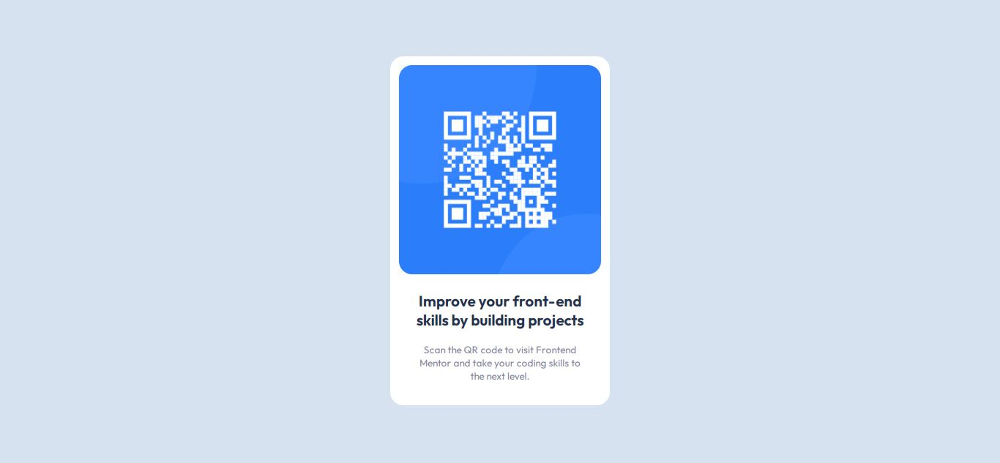

# Frontend Mentor - QR code component solution

This is a solution to the [QR code component challenge on Frontend Mentor](https://www.frontendmentor.io/challenges/qr-code-component-iux_sIO_H). Frontend Mentor challenges help you improve your coding skills by building realistic projects. 

## Table of contents

- [Overview](#overview)
  - [Screenshot](#screenshot)
  - [Links](#links)
- [My process](#my-process)
  - [Built with](#built-with)
- [Author](#author)

## Overview

### Screenshot
- Desktop

- Mobile

### Links

- Solution URL: [Add solution URL here](https://your-solution-url.com)
- Live Site URL: [Add live site URL here](https://your-live-site-url.com)

## My process

### Built with

- HTML 5
- CSS
- Flexbox
- CSS Grid
- Mobile-first workflow

### Useful resources

## Author

- Website - [Manis Tomar](https://github.com/manishtomarleo21?tab=repositories)
- Frontend Mentor - [@manishtomarleo21](https://www.frontendmentor.io/profile/manishtomarleo21)
- Twitter - [@yourusername](https://twitter.com/MaxTomar)

